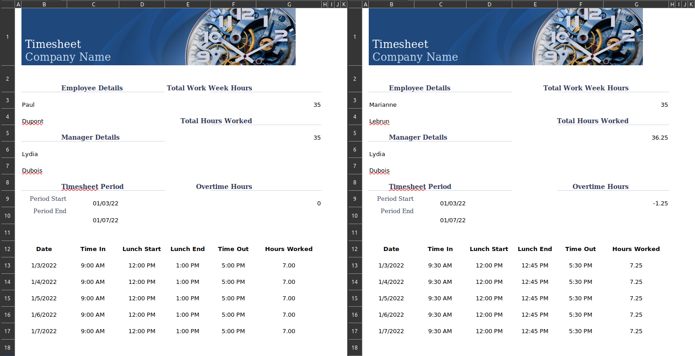

<!-- README.md is generated from README.Rmd. Please edit that file -->

```{r, include = FALSE}
knitr::opts_chunk$set(
  collapse = TRUE,
  comment = "#>",
  fig.path = "man/figures/README-",
  out.width = "100%"
)
```

# xlcutter

<!-- badges: start -->
[](https://opensource.org/licenses/MIT)
[](https://github.com/Bisaloo/xlcutter/actions/workflows/R-CMD-check.yaml)
[](https://app.codecov.io/gh/Bisaloo/xlcutter?branch=main)
[](https://www.reconverse.org/lifecycle.html#concept)
<!-- badges: end -->

This package allows you to parse entire folders of non-rectangular 'xlsx' files
into a single rectangular and tidy 'data.frame' based on a custom template file
defining the column names of the output.

## Installation

You can install the development version of this package from
[GitHub](https://github.com/) with:

``` r
# install.packages("remotes")
remotes::install_github("Bisaloo/xlcutter")
```

## Example

Non-rectangular excel files are common in many domains. For a simple
demonstration here, we use the example of the ["Blue
timesheet"](https://templates.office.com/en-us/blue-timesheet-tm77799521) from
<https://templates.office.com/>, where employees can log their working hours.

A typical use case of xlcutter in this example would be for a manager who want
to get a single rectangular dataset with the timesheets from different
employees.



Your first step to extract the data is to define the various columns you want
in the output in a *template* file. You can mark the data cells to extract with
any custom marker, with the default being `{{ column_name }}`.


```{r}
library(xlcutter)

data_folder <- system.file("example", "timesheet", package = "xlcutter")
template_file <- system.file(
  "example", "timesheet_template.xlsx",
  package = "xlcutter"
)

xlsx_cutter(
  data_folder,
  template_file
)
```

## Other example of use cases

Other typical use cases for this package could be:

- an hospital that wants to collate non-rectangular information sheets from
different patients into a single rectangular dataset


